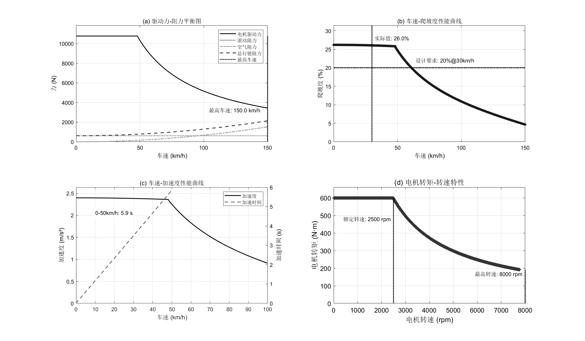
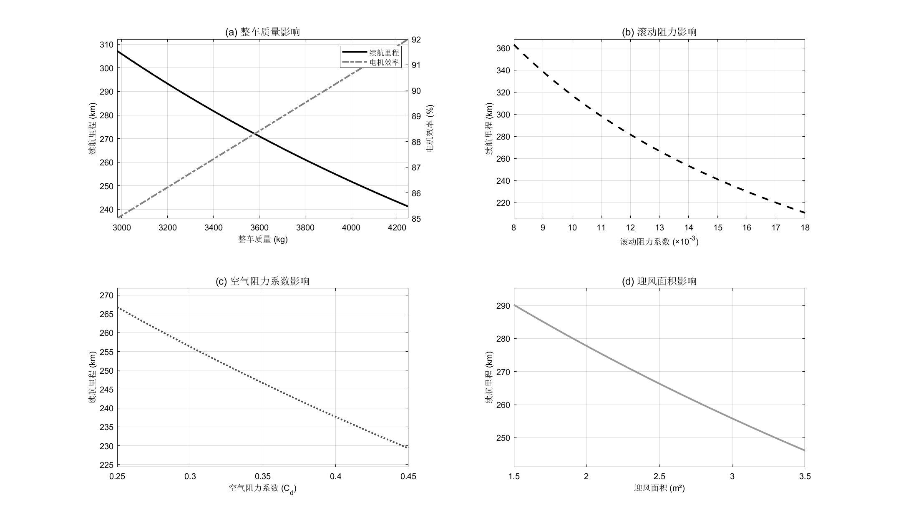

# 新能源汽车自动设计套件


[](mailto:kaguya810@petalmail.com)
[](https://github.com/kaguya810)
[](https://space.bilibili.com/35197337)

## 项目描述

**新能源汽车自动设计套件**是一个基于MATLAB的开源项目，专为车辆工程学生设计。该项目提供了一套课设参考方案，用于新能源汽车课程设计中可能有的动力系统参数匹配、性能分析和优化设计等任务。

全部公式来源于**南京工程学院交通工程学院《新能源汽车课程设计指导书》**。如有侵权请联系负责人删除！

本项目参考车辆理论（徐志生版）、新能源汽车（崔胜民版），根据给定的车辆参数和性能指标，自动完成：
- 电机参数校核（功率、转矩、转速）
- 电池系统设计（电压、容量、能量）
- 传动系统设计（传动比、齿轮参数、工艺合理性）
- 综合性能分析（最高车速、爬坡能力、加速性能）
- 续航影响因素研究（质量、阻力系数等）

所有代码均在GNU General Public License v3.0下开源，确保学术和工业应用的自由使用与共享。

## 安装与使用

### 系统要求
- MATLAB R2022a 或更高版本
- MATLAB 基本工具箱（不需要额外工具箱）

### 使用步骤
1. 克隆仓库到本地：
```bash
git clone https://github.com/Kaguya810/EVCar-AutoDesigner.git
cd EVCar-AutoDesigner
```

2. 在MATLAB中打开项目：
```matlab
EVCar
```

3. 顺序运行脚本：
```matlab
motordesign
battery
transmiss
```

4. 查看结果：
- 设计结果在命令窗口输出
- 续航分析图表以交互窗口（Figure）呈现。
- 有需要可自行另存为到目录中，项目不另外产生图像。

### Simulink模型运行方法
1. 在Matlab Simulink 模块中打开模块。

2. 运行模块，并调节仿真器步长优化图表。

3.  输入以下代码
```matlab
figure;
time = out.simout.data; % 时间向量（假设两个信号时间相同）
y1 = out.simout1.data;   % 第一个信号数据
y2 = out.simout10.data;   % 第二个信号数据

% 左 Y 轴
yyaxis left;
plot(time, y1, 'b-', 'LineWidth', 1.5);
ylabel('续航里程(km)');

% 右 Y 轴
yyaxis right;
plot(time, y2, 'r--', 'LineWidth', 1.5);
ylabel('电机效率eta');

% 添加标签和标题
xlabel('整车质量m(Kg)');
grid on;
legend('续航里程S(Km)', '电机效率eta', 'Location', 'best');
```
4.检查全部结构并保存。

### 文件结构
```
├── log.txt                # 输出示例
├── EVCar.prj              # 工程文件
├── motordesign.m          # 电机设计脚本
├── battery.m              # 电池参数设计
├── transmiss.m            # 传动系统设计
├── performance.m          # 性能分析
├── range.m                # 续航分析
└── plot/               # 图表存放目录
```

## 设计流程

### 1. 电机参数匹配
- 程序会根据最高车速、最大爬坡度和加速性能计算需求功率并校验
- 自行到网路中检索合适电机型号
- 设置电机额定功率、峰值功率、转速范围等参数

### 2. 电池系统设计
- 根据电压要求确定串联单体数
- 根据续驶里程要求计算总能量需求
- 校核峰值功率输出能力
- 输出电池组电压、容量、能量和质量

### 3. 传动系统设计
- 确定传动比范围（基于爬坡和最高车速要求）
- 齿轮参数设计（模数、压力角、螺旋角）
- 轴径设计（输入轴、半轴）
- 输出传动比、齿轮参数和轴径

### 4. 性能分析
- 驱动力-阻力平衡图（最高车速分析）
- 车速-爬坡度曲线（爬坡性能分析）
- 车速-加速度曲线（加速性能分析）
- 电机转矩-转速特性曲线

### 5. 续航分析
- 整车质量对续航里程的影响
- 滚动阻力系数对续航里程的影响
- 空气阻力系数对续航里程的影响
- 迎风面积对续航里程的影响

## 结果展示

### 综合性能分析图


### 续航影响因素分析


### 风阻-续航影响分析


## 设计案例

本项目包含一个完整的纯电动商务车设计案例：
- 车型：6米纯电动商务车
- 设计指标：
  - 最高车速：120km/h
  - 0-50km/h加速时间：≤9s
  - 最大爬坡度：20%@30km/h
  - 续驶里程：≥200km（60km/h匀速）

逐次运行可查看完整设计结果。

## 贡献指南

欢迎贡献代码！请遵循以下步骤：
1. Fork 本仓库
2. 创建新分支 (`git checkout -b feature/your-feature`)
3. 提交更改 (`git commit -am 'Add some feature'`)
4. 推送分支 (`git push origin feature/your-feature`)
5. 创建 Pull Request

## 许可证

本项目采用 GPL 3.0 许可证 - 详情请参阅 [LICENSE](LICENSE) 文件。

## 联系方式

如有任何问题或建议，请联系：
- 项目负责人：KAGUYA810
- 问题追踪：[GitHub Issues](https://github.com/Kaguya810/EVCar-AutoDesigner/issues) (优先考虑)

---
## 本工具为车辆工程的同学们提供新能源汽车课程设计参考方案，如不审查数据结果强行套用，产生后果概不负责。
